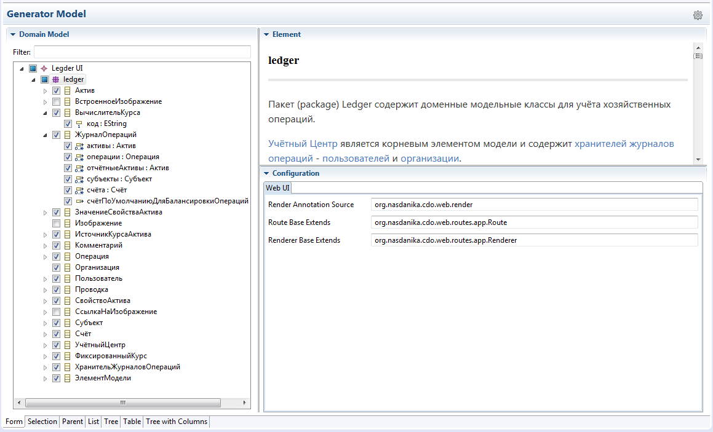

# Web UI Generation Target

The Web UI generation target generates artifacts which are used by [Nasdanika CDO Web Application Rendering](https://github.com/Nasdanika/server/blob/master/org.nasdanika.cdo.web/doc/application-rendering.md) framework for rendering web applications backed by CDO repositories.

[Nasdanika Ecore Code Generation Editor](https://github.com/Nasdanika/codegen-ecore) with the Web UI target:

## Documentation

[JavaDoc](http://www.nasdanika.org/products/codegen-ecore-web-ui/apidocs/org.nasdanika.codegen.ecore.web.ui/apidocs)

### Configuration

* [Root](org.nasdanika.codegen.ecore.web.ui/doc/configuration/root-configuration.md)
* [EPackage](org.nasdanika.codegen.ecore.web.ui/doc/configuration/epackage-configuration.md)
* [EClass](org.nasdanika.codegen.ecore.web.ui/doc/configuration/eclass-configuration.md)
* [EAttribute](org.nasdanika.codegen.ecore.web.ui/doc/configuration/eattribute-configuration.md)
* [EReference](org.nasdanika.codegen.ecore.web.ui/doc/configuration/ereference-configuration.md)
* [EOperation](org.nasdanika.codegen.ecore.web.ui/doc/configuration/eoperation-configuration.md)

### Generated Artifacts

* [plugin.xml](org.nasdanika.codegen.ecore.web.ui/doc/generated-artifacts/plugin-xml.md)
* [Renderer base](org.nasdanika.codegen.ecore.web.ui/doc/generated-artifacts/renderer-base.md)
* [Route base](org.nasdanika.codegen.ecore.web.ui/doc/generated-artifacts/route-base.md)
* [Renderers](org.nasdanika.codegen.ecore.web.ui/doc/generated-artifacts/renderers.md)
* [Routes](org.nasdanika.codegen.ecore.web.ui/doc/generated-artifacts/routes.md)
* [Resources](org.nasdanika.codegen.ecore.web.ui/doc/generated-artifacts/resources.md)

### Generator Model

This is a screenshot of the [generator model](org.nasdanika.codegen.ecore.web.ui/web-ui.nsdgen) open in the codegen editor:

## P2 Repository

* ``http://www.nasdanika.org/products/codegen-ecore-web-ui/repository``
* [Archived](http://www.nasdanika.org/products/codegen-ecore-web-ui/org.nasdanika.codegen.ecore.web.ui.repository-0.1.0-SNAPSHOT.zip)
 
## Roadmap

* Support of EOperations and EParameters.

## How to contribute

As an open source project we use the [Fork and Pull Model](https://help.github.com/articles/about-collaborative-development-models/).
You can find more information about collaborative development at GitHub in this article - [Collaborating with issues and pull requests](https://help.github.com/categories/collaborating-with-issues-and-pull-requests).

When you contribute code, please make sure that the changes are clearly identifiable. In particular, avoid making non-functional changes in the code which you do not touch, 
e.g. auto-formatting of an entire compilation unit. 

