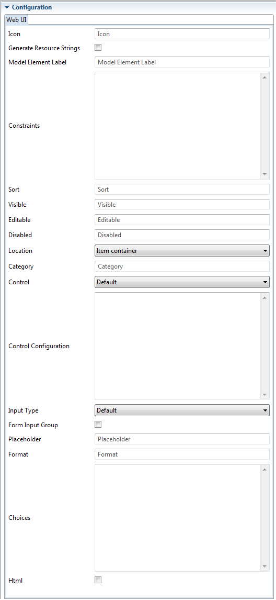

# EAttribute configuration

## Icon
Icon for a model element such as EClass or EStructuralFeature.
If icon contains ``/`` it is treated as URL, otherwise it is treated as css class, e.g. Bootstrap's ``glyphicon glyphicon-close``.

## Generate Resource Strings
If set to true, the generator generates resource strings in resource bundles 
properties files. Resource strings are generated from model annotations and
using default values if annotations are not present. 

Generation of resource strings simplifies localization. It does not alter the application
behavior for default locale.

## Model Element Label
EClass or EStructuralFeature label.

## Constraints
Constraint shall be a YML text which defines a single constraint or a list of constraints. Constraint can be a string or a map containing:

* ``condition`` - XPath expression boolean expression.
* ``errorMessageKey`` - Optional error message key. If it is present, error message is retrieved as resource string.
* ``errorMessage`` - Error message to display if the expression evaluates to false. It is used if ``errorMessageKey`` is not defined or if there is no resource string for the key. 

If the constraint is a String, then it is treated as ``condition`` XPath expression and error message is constructed as ``Constraint violation: <condition>``. 

## Sort
XPath expression to use for sorting of items in tables and lists.

## Visible
Defines whether the feature is visible in the object view.
The value can be one of the following:

* Blank string or ``true`` boolean literal - the feature is visible.
* ``false`` boolean literal - the feature is hidden.
* [JXPath](https://commons.apache.org/proper/commons-jxpath/index.html) expression. If this expression evaluates to ``true`` (compared with ``Boolean.TRUE``), then the feature is visible.

## Editable
Defines whether the feature is editabe if it is already visible.
The value can be one of the following:

* Blank string - the feature is editable if it is not an item (``isItem()`` returns false)
* ``true`` boolean literal - the feature is editable
* ``false`` boolean literal - the feature is not editable.
* [JXPath](https://commons.apache.org/proper/commons-jxpath/index.html) expression. If this expression evaluates to ``true`` (compared with ``Boolean.TRUE``), then the feature is editable.

## Disabled
Defines whether an editable feature is disabled, i.e. it shall be displayed in the edit form, but the edit control shall be disabled.

* ``false`` boolean literal or empty string - the feature is enabled (default).* ``true`` boolean literal - the feature is disabled.
* [JXPath](https://commons.apache.org/proper/commons-jxpath/index.html) expression. If this expression evaluates to ``true`` (compared with ``Boolean.TRUE``), then the feature is disabled.

## Location
Format is used for rendering and parsing date and number feature values. 
SimpleDateFormat for dates, DecimalFormat for numbers.

## Category
Feature category. Categories are displayed as panels in the view and the left panel, and field sets in edit forms.

Features with a common prefix are auto-categorized if not explicitly categorized. E.g. features ``databaseUser`` and ``databasePassword`` will be auto-categorized under the category ``Database`` with
labels ``User`` and ``Password`` respectively.

## Control

Edit form control type for the feature. Defaults to input for attributes and multi-value features and select for references.

## Control Configuration
YAML map with keys corresponding to control attribute names, and values being JXPath expressions evaluating to attribute values. 

## Input Type
Input type if control is "Input".

## Form Input Group
Set it to true to force rendering of the form control in a {@link FormInputGroup} instead of {@link FormGroup} or
to false to force the opposite. If this annotation is not present then inputs with either icon (rendered on the left) or help icon (rendered on the right) 
are rendered as form input groups.  

## Placeholder
XPath expression evaluating to the placeholder value for features. Placeholder value is an implicit application-specific value, different from the 
default value. For example, in hierarchical structures children may implicitly inherit parent feature value, unless it is explicitly set (overridden) in the child.

In the absence of feature value (null or blank string for strings) placeholder values are displayed in the view in a small {@link Well}.

## Format
Format is used for rendering and parsing date and number feature values. 
SimpleDateFormat for dates, DecimalFormat for numbers.

## Choices
YAML map of values to labels or list if values and labels are the same. 

## Html
If control is ``textarea`` and ``html`` is set to ``true`` then the textarea is initialized with [TinyMCE](https://www.tinymce.com) editor. 
