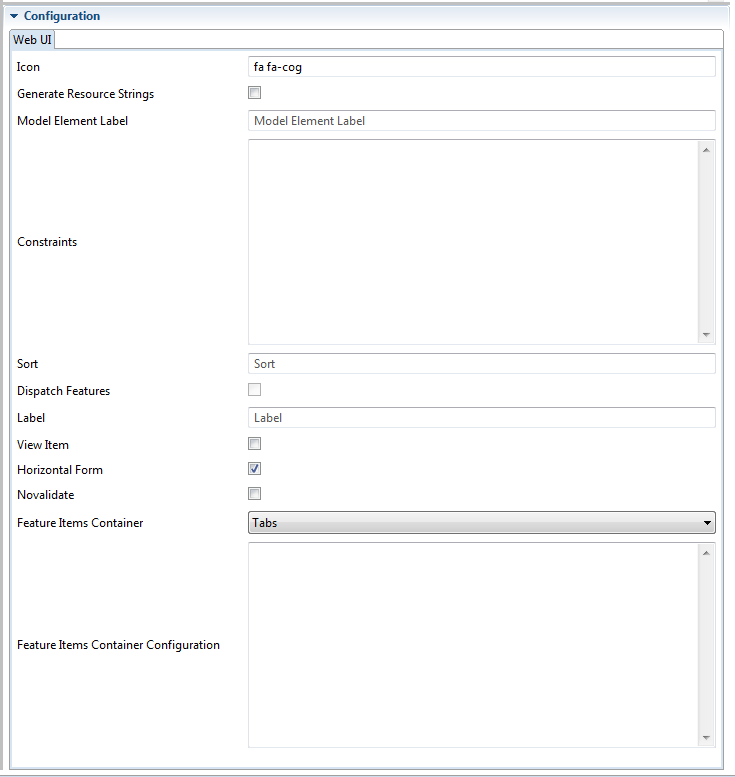

# EClass Configuration

## Icon
Icon for a model element such as EClass or EStructuralFeature.
If icon contains ``/`` it is treated as URL, otherwise it is treated as css class, e.g. Bootstrap's ``glyphicon glyphicon-close``.

## Generate Resource Strings
If set to true, the generator generates resource strings in resource bundles 
properties files. Resource strings are generated from model annotations and
using default values if annotations are not present. 

Generation of resource strings simplifies localization. It does not alter the application
behavior for default locale.

## Model Element Label
EClass or EStructuralFeature label.

## Constraints
Constraint shall be a YML text which defines a single constraint or a list of constraints. Constraint can be a string or a map containing:

* ``condition`` - XPath expression boolean expression.
* ``errorMessageKey`` - Optional error message key. If it is present, error message is retrieved as resource string.
* ``errorMessage`` - Error message to display if the expression evaluates to false. It is used if ``errorMessageKey`` is not defined or if there is no resource string for the key. 

If the constraint is a String, then it is treated as ``condition`` XPath expression and error message is constructed as ``Constraint violation: <condition>``. 

## Sort
XPath expression to use for sorting of items in tables and lists.

## Dispatch Features
If set to true, the generator generates render``feature name``FeatureXXX(C,T,EStructuralFeature,...) and overrides renderFeatureXXX(C,T,EStructuralFeature,...)
to dispatch invocations to feature-specific methods. This does not alter the default renderer behavior, but makes the variability points explicit and easier to customize.

## Label
A pattern which is interpolated to generate object label.

## View Item
Set this to ``true`` to have the class view rendered in the item container. 

## Horizontal Form
 By default EClass edit forms are rendered as horizontal forms. Set this to ``false`` to change the default rendering.

## Novalidate
Set to true to disable HTML 5 form validation, e.g. if you have a required
text area with TinyMCE editor in Chrome.

## Feature Items Container
Feature items container.

## Feature Items Container Configuration
Feature items container configuration.

For accordion:

* style: Bootstrap style, e.g. PRIMARY

For pills:

* stacked: true or false
* justified: true or false
* width: 1 - 11

For tabs:

* justified: true or false

