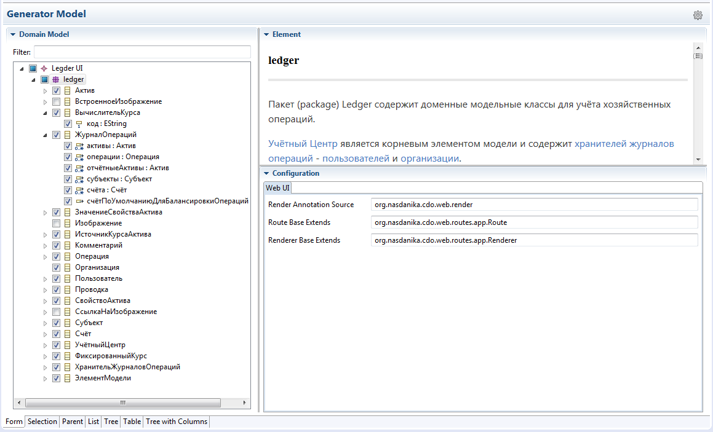

# Web UI Generation Target

The Web UI generation target generates artifacts which are used by [Nasdanika CDO Web Application Rendering](https://github.com/Nasdanika/server/blob/master/org.nasdanika.cdo.web/doc/application-rendering.md) framework for rendering web applications backed by CDO repositories.

## Configuration

* [Root](configuration/root-configuration.html)
* [EPackage](configuration/epackage-configuration.html)
* [EClass](configuration/eclass-configuration.html)
* [EAttribute](configuration/eattribute-configuration.html)
* [EReference](configuration/ereference-configuration.html)
* [EOperation](configuration/eoperation-configuration.html)

## Generated Artifacts

* [plugin.xml](generated-artifacts/plugin-xml.html)
* [Renderer base](generated-artifacts/renderer-base.html)
* [Route base](generated-artifacts/route-base.html)
* [Renderers](generated-artifacts/renderers.html)
* [Routes](generated-artifacts/routes.html)
* [Resources](generated-artifacts/resources.html)

 